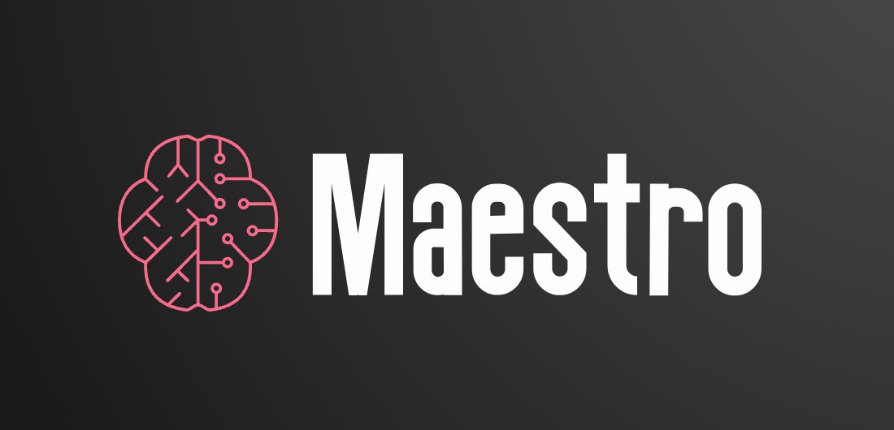

# maestro-student
This repository contains the student version of the maestro platform to learn adversarial machine learning algorithms.
The paper "Maestro: a gamified platform for teaching AI robustness" ([link](https://dl.acm.org/doi/10.1609/aaai.v37i13.26878)) was accepted at the Thirteenth Symposium on Educational Advances in Artificial Intelligence, EAAI 2023.



## Installation
To install the Maestro Platform, follow these steps:
1. Create a python environment by [conda](https://docs.anaconda.com/free/anaconda/install/index.html) or [virtualenv](https://virtualenv.pypa.io/en/latest/installation.html).
```bash
# take conda as an example
conda create -n maestro-student python==3.9.11
conda activate maestro-student
```
2. Clone the repository:
```bash
git clone git@github.com:C0ldstudy/maestro-student.git
```
3. Navigate to the project directory

4. Install the required python packages
```bash
pip install -r requirements.txt
```

## Usage
We list six tasks for students to complete. It also supports adding other assigments follow our basic code structure.
For each task, we provide a brief README file that includes the background information, required datasets, and evaluation requirements. To gain a deeper understanding of each task, we also list related knowledge and papers for further reading.

- Attack Homework: [Gentic Algorithm](https://arxiv.org/abs/1906.03181)
- Attack Project: [PGD](https://arxiv.org/abs/1706.06083), [CW](https://arxiv.org/abs/1608.04644).
- Defense Homework/Project: [Adversarial Training](https://arxiv.org/abs/1412.6572)

## Teacher Version
If you are interested in obtaining the teacher version, please send a request to `maestro.uci@gmail.com`.

## Citation
```
@inproceedings{DBLP:conf/aaai/GeletaXLW00M23,
  author       = {Margarita Geleta and
                  Jiacen Xu and
                  Manikanta Loya and
                  Junlin Wang and
                  Sameer Singh and
                  Zhou Li and
                  Sergio Gago Masagu{\'{e}}},
  editor       = {Brian Williams and
                  Yiling Chen and
                  Jennifer Neville},
  title        = {Maestro: {A} Gamified Platform for Teaching {AI} Robustness},
  booktitle    = {Thirty-Seventh {AAAI} Conference on Artificial Intelligence, {AAAI}
                  2023, Thirty-Fifth Conference on Innovative Applications of Artificial
                  Intelligence, {IAAI} 2023, Thirteenth Symposium on Educational Advances
                  in Artificial Intelligence, {EAAI} 2023, Washington, DC, USA, February
                  7-14, 2023},
  pages        = {15816--15824},
  publisher    = {{AAAI} Press},
  year         = {2023},
  url          = {https://doi.org/10.1609/aaai.v37i13.26878},
  doi          = {10.1609/AAAI.V37I13.26878},
  timestamp    = {Sun, 12 Nov 2023 02:11:30 +0100},
  biburl       = {https://dblp.org/rec/conf/aaai/GeletaXLW00M23.bib},
  bibsource    = {dblp computer science bibliography, https://dblp.org}
}
```
