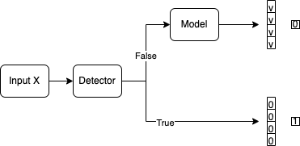

# Defense War

## API update
In the `task/defense_war/submission/predict.py` file, `get_batch_output` and `detect_attack` are updated. When designing your detector and defense model, please consider the pipeline the evaluator uses in the figure. Basically, when we feed the images to the defender, a detector is expected to decide whether the images are adv examples or not. If they are adv examples, a 4 elements zero array and a number 1 are outputted. Otherwise, the images are fed to the model and the possibilities with a  number 0 are outputted.



## Dowloading datasets
Download the datasets from the teacher version and copy them the following path
```
tasks/defense_war/datasets/CIFAR10/student/
```

## Assignment
Complete or revise the train.py and predict.py in the following path and then run the train.py file by the following commands to generate the defense_war-model.pth file.
```
$ cd tasks/defense_war/submission/ # predict.py and train.py are under the path.
$ python train.py
```

## Evaluating the submissions
Run the evaluator by following steps
```
$ cd tasks/defense_war/
$ python Evaluator_defense_war.py
```


## Results
View your results at
```
tasks/defense_war/results.json
```
## Submit
Submit all the related files including `predict.py` and the `defense_project-model.pth` by GradeScope without changing the original file names.

## Evaluation metrics
The score contains two parts: The raw accuracy score cover 40% and four attack methods cover 60% equally. The raw accuracy over 50% starts to earn points and if the rar accuracy is over 77% you can get the whole 40 points. As to each attack method, if you defend one successfully (the attack success rate is 0%), you will get 15 points. Two attack methods (PGD and one black box attack) will be released and the other two are hidden.

`raw accuracy score = max((min(results["raw_acc"] - 50, 27)/27)*40, 0)`

`each attack method score = (max(100-success_rate, 0)/100) * 70 + (1-max(1500-query, 0)/1500) * 20 + (1-max(15-distance, 0)/15) * 10`
